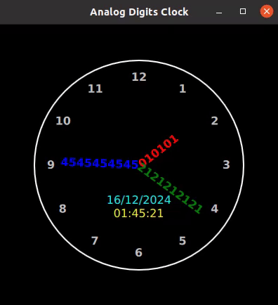

# AnalogDigitsClock

**AnalogDigitsClock** is a project that visualizes time using an analog clock with a unique digital-style representation, developed using QML and C++.



## Features
- Combines analog and digital clock aesthetics.
- Responsive and visually appealing design using QML.
- Cross-platform compatibility.

## Requirements
- **Qt 5.15+** (or later)
- C++ Compiler compatible with Qt

## Build Instructions
1. Clone the repository:
    ```bash
    git clone https://github.com/tackelua/AnalogDigitsClock.git
    cd AnalogDigitsClock
    ```
2. Open the `AnalogDigitsClock.pro` file in **Qt Creator**.
3. Configure the project and click the **Build** button.

## Usage
Run the application after building to display the clock.

## License
This project is licensed under the [Creative Commons Attribution 4.0 International License](https://creativecommons.org/licenses/by/4.0/). You are free to use, modify, and share the code as long as you provide appropriate credit to the original author.
